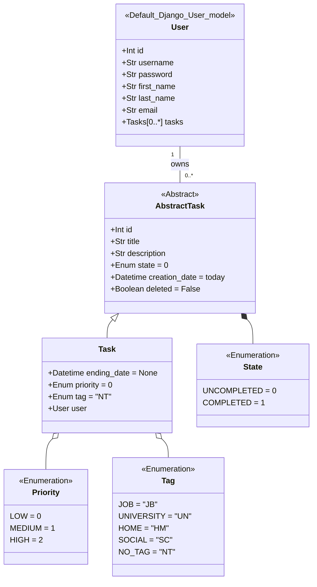
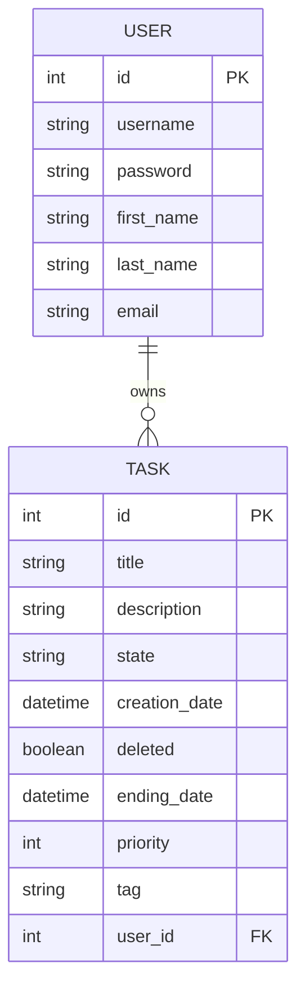

# Diagrama de clases

```mermaid
classDiagram
		%% Classes definition
		class User {
				+Int id
				+Str username
				+Str password
				+Str first_name
				+Str last_name
				+Str email
				+Tasks[0..*] tasks
		}
		<<Default_Django_User_model>> User
		class AbstractTask {
				+Int id
				+Str title
				+Str description
				+Enum state = 0
				+Datetime creation_date = today
				+Boolean deleted = False
		}
		<<Abstract>> AbstractTask
		class Task {
				+Datetime ending_date = None
				+Enum priority = 0
				+Enum tag = "NT"
				+User user
		}
		class State {
				UNCOMPLETED = 0
				COMPLETED = 1
		}
		<<Enumeration>> State
		class Priority {
				LOW = 0
				MEDIUM = 1
				HIGH = 2
		}
		<<Enumeration>> Priority
		class Tag {
				JOB = "JB"
				UNIVERSITY = "UN"
				HOME = "HM"
				SOCIAL = "SC"
				NO_TAG = "NT"
		}
		<<Enumeration>> Tag
		
		%% Relationships
		User "1" -- "0..*" AbstractTask: owns
		AbstractTask <|-- Task
		AbstractTask *-- State
		Task o-- Priority
		Task o-- Tag

		
```

# Modelo entidad-relacion

```mermaid
erDiagram
		USER ||--o{ TASK : owns
		USER {
        int id PK
				string username
				string password
        string first_name
				string last_name
        string email
    }
		TASK {
				int id PK
				string title
				string description
        string state
				datetime creation_date
        boolean deleted
				datetime ending_date
				int priority
				string tag
				int user_id FK
		}
```