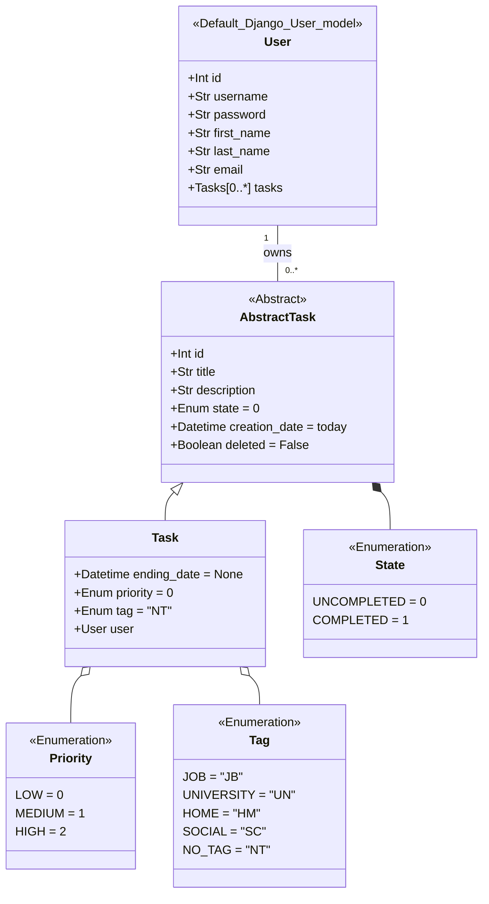
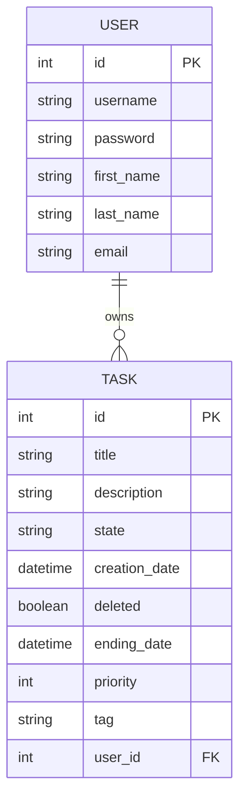

# Recomendaciones para ejecutar el proyecto

Ejecutar los siguiente comandos iniciales:
```cmd
python manage.py migrate
```

```cmd
python manage.py makemigrations
```

```cmd
python manage.py createsuperuser
```

## Ejecutar pruebas unitarias
```cmd
python manage.py test
```

# Variables de entornos
Para que el proyecto lea las variables de entorno se debe crear un archivo llamado _.env_ e incluir las siguientes variables:

```cmd
SECRET_KEY=django-insecure-(w7d9$##n6bp=xep7wx!=aoxczlswf=bo4!$729%_+!zdn$o+!
DEBUG=True
SETTINGS=local
DATABASE_NAME=local
```

# CORS
En la configuracion de la aplicacion (archivo _settings.py_ -> _base.py_ -> variable _CORS_ALLOWED_ORIGINS_) se especifica que la aplicacion solo acepta llamados del _localhost_, para que la aplicacion acepte tambien llamados de alguna aplicacion front su dominio debe agregarse al listado de _CORS_ALLOWED_ORIGINS_.

# Pasos para consumir algun _endpoint_
1. Iniciar sesion: Esto se logra consumiento el endpoint con URI ```/user/login/```, el cual retorno un diccionario con el token de acceso y el token de refresco.
2. Agregar el token de acceso dado, de tipo _Bearer_ a cada peticion realizada a _Task_.

# Diagrama de clases


# Modelo entidad-relacion
